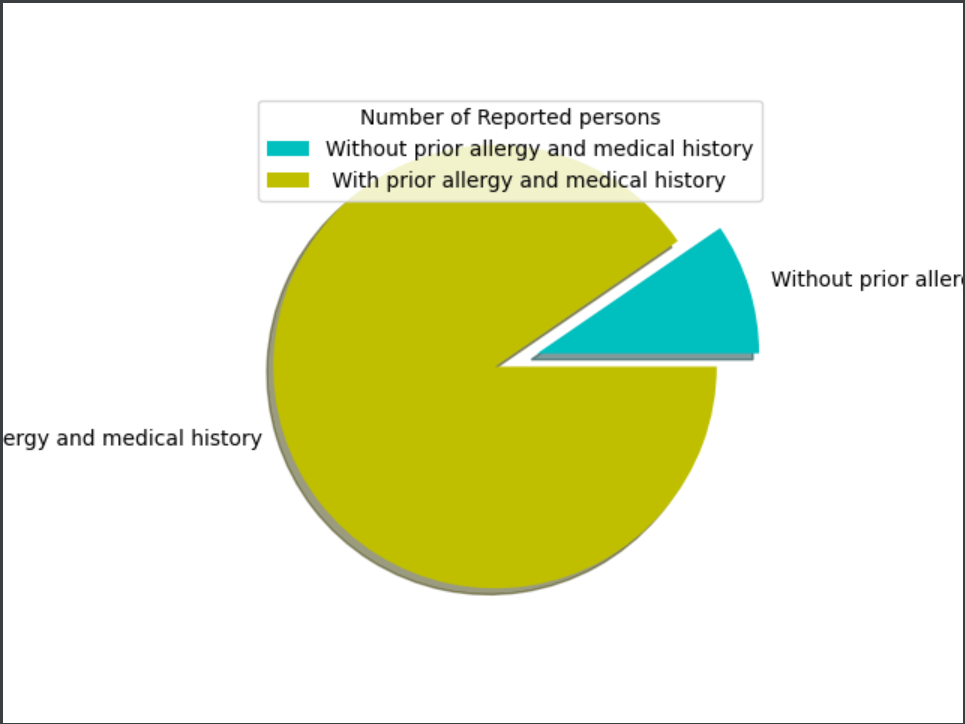
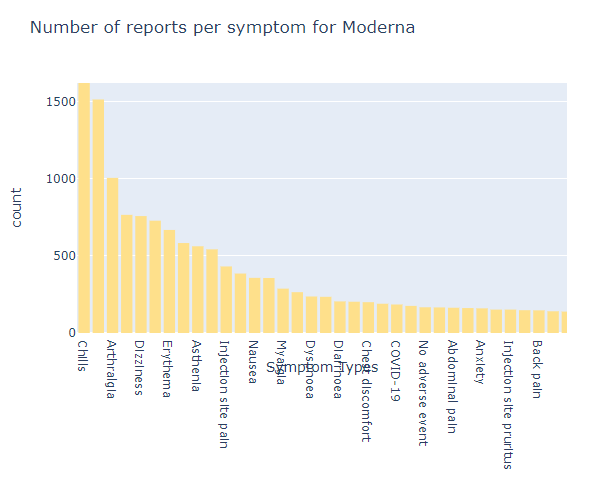
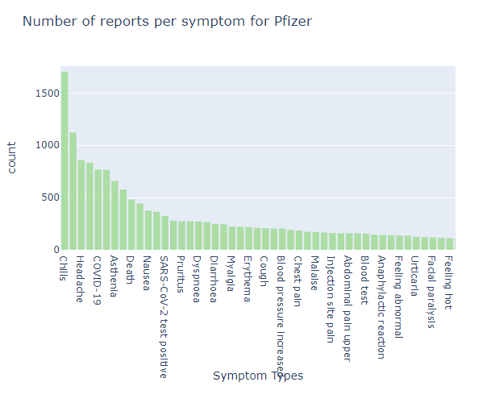
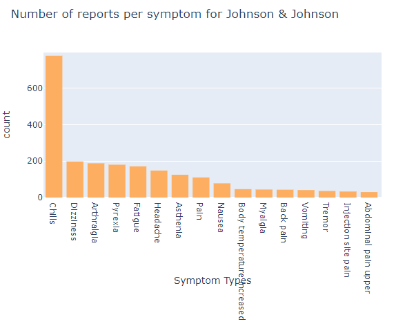

# 2021_Spring_finals
### Team Members:
1) Nikhil Shenoy (nshenoy3), GitHub: nshenoy3  
2) Anish Pai (asp8), GitHub: anishpai07  
3) Vedant Desai (vdesai29), GitHub: vedantdesai28  

## Vaccine Adverse Effect Reporting System (VAERS) Analysis for COVID-19 Vaccines.  

### About VAERS
  
_image referenced from covidvaccine.mo.gov  _ 
Established in 1990, the Vaccine Adverse Event Reporting System (VAERS) is a national early warning system to detect possible safety problems in U.S.-licensed vaccines. VAERS is co-managed by the Centers for Disease Control and Prevention (CDC) and the U.S. Food and Drug Administration (FDA). VAERS accepts and analyzes reports of adverse events (possible side effects) after a person has received a vaccination.

### Project Goal
Our goal is to analyze COVID-19 vaccination data by exploring the VAERS Vaccination, VAERS Patient Data and VAERS Symptoms datasets for the dates JAN-APRIL 2021. We will not only be exploring three different COVID Vaccines (MODERNA, PFIZER, JANSSEN) related data but will also look into Patient data such as age, any pre-existing medical conditions, allergies, etc. Finally, also want to get an idea of which vaccine has proven to be the most efficient in terms of preventing the recontraction of COVID and minimum resulting symptoms in the patient. 

### Hypothesis 1
Conducting a test to identify which vaccine manufacturer had the lowest rate of reported adverse effects.  

H0: Vaccines manufactured by Moderna have the lowest rate of reported adverse effects.  
HA: A vaccine manufactured by a company other than Moderna will have the lowest rate of reported adverse effects.  

Here, we observe the reported adverse cases for each vaccine manufacturer across all the states in the US. However, these numbers are inconclusive without knowing the total count of doses administered.

Hence, upon further analysis, we find that Pfizer had the largest number of doses distributed across all states, followed by Moderna and J&J.  

We can calculate the Rate of VAERS reporting as follows: 

Rate VAERS reports = Number of Reported Adverse Cases/Total Vaccines Administered * 100  
Rate VAERS (Pfizer) = 0.106%  
Rate VAERS (Moderna) = 0.138%  

Hence, we can reject H0 which stated that Moderna would have the lowest rate of reported adverse cases.

### Hypothesis 2
<h1>HYPOTHESIS 2</h1>

<b>Hypothesis :</b> People with underlying health conditions or allergies are more likely to develop symptoms after taking a vaccine. 

The Aim of this hypothesis is to determine if any existing allergies and health conditions played a role in person developing symptoms post covid vaccination. 

<b>Note:</b> For presentation purpose we have just cleaned the complete data set to normalize existing allergies and existing medical history column so that we could do some analyses.  
We have analyzed for now how many people with existing issues developed any symptom against people with no existng issues developing symptoms post getting vaccinated.

### Hypothesis 3
<b>Hypothesis: </b>Experts predict that usually the onset of the symptoms from the side effect of vaccines usually start to hit within 24 hours of the dose and do not stretch 7 days post the vaccination  
 
A lot of data is the dataset was missing. This dataset there were lot of typing mistakes as well, which were affecting the graphs and the calulations. Hence a lot of data cleaning had to be performed on this dataset  
I have considered the data of the 3 Major vaccines: Moderna, Pfizer and Jannsen.

H0: Onset of symptoms from the vaccine start with 24 hours of the vaccination  
HA: Onset of symptoms from the vaccine start after 24 hours of the vaccination

Onset of Symptoms after being vaccinated by Moderna vaccine  

Onset of Symptoms after being vaccinated by Pfizer vaccine  

Onset of symptoms after being vaccinated by Jannsen vaccine  

The graphs clearly show that in most of the cases the symptoms do start to show up in the first 48 hours.  

Further Analysis  
We have another dataset containing the number of COVID vaccines administered everyday in the month of January 2021 in all the states of the US. We plan to use this to compare the number of cases with side effects reported with the number of vaccines administered per state
 
### Hypothesis 4

<b> Hypothesis: </b> Injection Site Pain is the most common Symptom among all COVID 19 vaccines.

In order to prove the hypothesis we had to first merge the symptoms reported by each person and then segregate the symptoms based the vaccine types. 

Below is our analysis of the most common symptoms reported by vaccine type:

<b> 1: Moderna Vaccine</b>

In the above graph showing symptoms reported post taking Moderna Vaccine. It is clear that the most reported symptoms are chills and injection site erythema.

<b> 2: Pfizer Vaccine</b>

In the above graph showing symptoms reported post taking Pfizer Vaccine. It is clear that the most reported symptoms are chills and headaches.

<b> 3: Johnson and Johnson Vaccine</b>

In the above graph showing symptoms reported post taking Janssen Vaccine. It is clear that the most reported symptom are chills and dizziness.

<b>Conclusion:</b> From the above graphs its clear that our hypothesis can be rejected. We can conclude that chills is the most common reported symptoms among all vaccines and not injection site pain.

